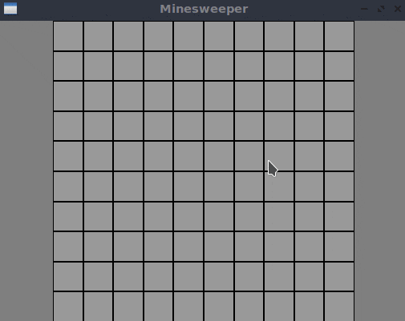
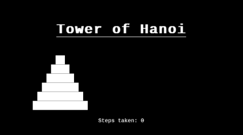

# Chitrakaar

**Chitrakaar** is a lightweight C++11 library that makes drawing 2D graphics a breeze with simple, procedural calls. It provides straightforward access to mouse and keyboard input, so you can create interactive visuals without getting tangled up in object-oriented programming, complex resource management, or event loop headaches. If you’re comfortable with basic types like `bool`, `int`, `double`, and `std::string`, you’re all set. Under the hood, Chitrakaar is a clean wrapper around SDL2—the only external dependency.

Building applications with Chitrakaar is designed to be effortless. Sample projects and helper scripts come bundled, and if you’re using [Visual Studio Code](https://code.visualstudio.com/), the setup is completely automated. For detailed build instructions, check out the [How_to_build.md](docs/How_to_build.md) guide.

Chitrakaar works across Windows, macOS, Linux, and even Emscripten. With a few tweaks, you can also target iOS or Android.

---

## Examples

Explore a couple of simple projects built with Chitrakaar—both under 200 lines of code:




---

## Why Choose Chitrakaar?

Chitrakaar is all about minimizing the boilerplate needed to get a basic GUI window up and running. It’s perfect for small projects where you want to focus on drawing cool graphics without worrying about window management or state propagation. Need to draw a circle? Just call `ck::circle` and let Chitrakaar handle the rest.

This library is also ideal for beginners. Instead of spending time hunting down and patching together various GUI code snippets from the internet, you can start creating visual applications in C++ right away. Visualizations, like a fun rendition of the Tower of Hanoi, are more engaging than plain console output:



---

## How to Use

Here’s a simple “Hello World” example that works on all supported platforms:

```cpp
#include "chitrakaar.hpp"

int main() {
    ck::create_window("HELLO WORLD", 200.0, 200.0);
    ck::circle(100.0, 100.0, 50.0);
    ck::wait_until_closed();
    return 0;
}
```

All necessary functions are provided by the header file `include/chitrakaar.hpp`. A key rule to remember is to avoid calling any blocking functions outside of those offered by Chitrakaar—this ensures that your window remains responsive. For more detailed guidance, please refer to [Introduction.md](docs/Introduction.md) and [How_to_build.md](docs/How_to_build.md).

---

## What Chitrakaar Is _Not_ For

Chitrakaar is built for simplicity rather than high performance or extensive features. It isn’t meant to replace full-fledged UI toolkits like [FLTK](https://www.fltk.org/) or [Dear ImGui](https://github.com/ocornut/imgui), nor is it intended for intensive game development like [SFML](https://www.sfml-dev.org/) or raw [SDL](https://www.libsdl.org/). If you need the ultimate performance of OpenGL or a highly flexible framework, you might want to explore other options. Chitrakaar is best suited for small projects and educational experiments.

---

## Acknowledgments

Chitrakaar is powered by SDL2 and leverages several robust libraries. Special thanks to the creators and maintainers of:

- [SDL2](https://www.libsdl.org/) – the backbone dependency
- [GLAD](https://github.com/Dav1dde/glad) – for generating OpenGL loader code
- [stb_image](https://github.com/nothings/stb) – integrated directly in the source
- [stb_truetype](https://github.com/nothings/stb) – also embedded within the code

The default font packaged with Chitrakaar is [Hack](https://github.com/source-foundry/Hack), with encoding and decoding routines inspired by [Dear ImGui](https://github.com/ocornut/imgui). The mechanism for downloading SDL2 via CMake is adapted from practices in [PrusaSlicer](https://github.com/prusa3d/PrusaSlicer).

---

## Notes

The source code for Chitrakaar is hosted on [GitHub](https://github.com/shkshreyas/chitrakaar). You can report issues using the [GitHub issue tracker](https://github.com/shkshreyas/chitrakaar/issues). While pull requests are welcome, please note that only minor bug fixes are likely to be merged, as the focus remains on keeping the library simple and accessible.

---

_Created by shreyas (GitHub: [shkshreyas](https://github.com/shkshreyas))_
